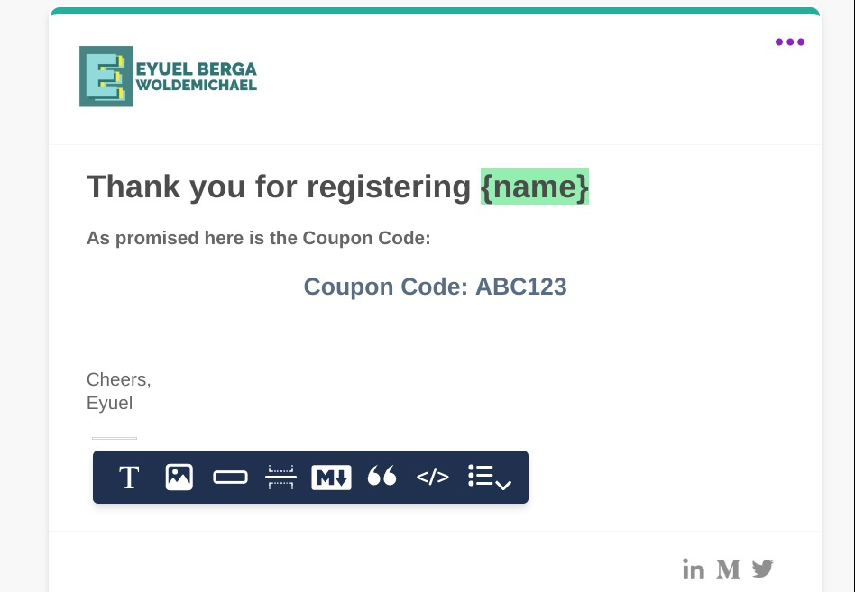
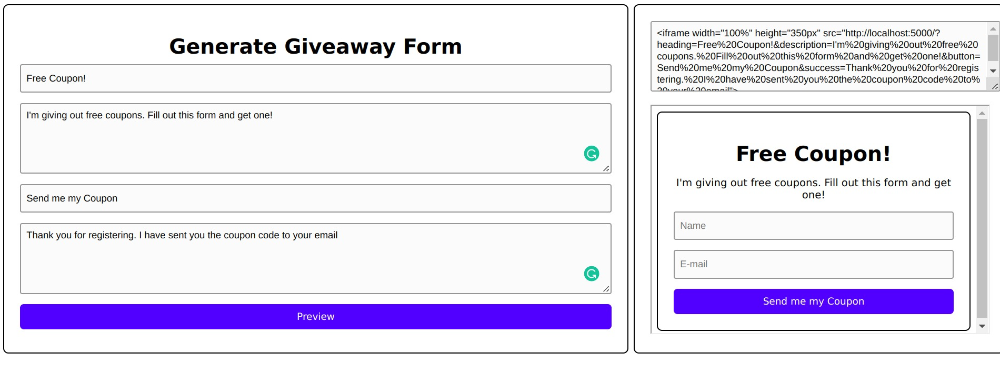
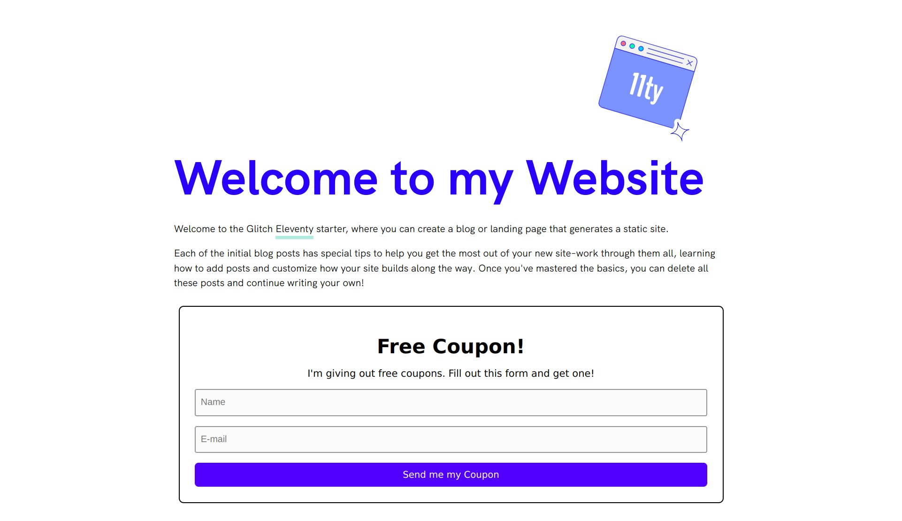

# Email Giveaway Widget

An easy-to-use tool powered by Courier to help you quickly add an email giveaway form to your website.

You can use it to email customers free guides, ebooks, Coupons, Promo Codes, and more. You can also easily change the contents of the form like the heading and the success message. 

It is powered by [Courier](https://courier.com); when users sign up for the giveaway, an email will automatically be sent to their inbox. It also utilizes the List API to add users who register for the giveaway to a specific list.

Using the form generator tool, you can easily customize your giveaway form and generate an embed code to add to your website. 

## Usage

### 1. Design

Using the Courier Designer, create an email that will be sent to users who signup for the giveaway.

### 2. Configure

Before you deploy your giveaway service, you need to get a few things:

- **COURIER_KEY**: your Courier authorization token
- **NOTIFICATION_TEMPLATE**: notification Id for email template
-  **LIST_ID**: the name of the list you want users to be placed
- **ALLOW_LIST**: comma-separated list of URLs for cors access

You will need to set these values as environment variables in your deployment

### 3. Deploy

Deploy the app to a hosting provider of your choice. Make sure the hosting provider supports NodeJs applications

### 4. Generate

After successfully deploying the service, go to the `/preview` page and fill out the form to get an embed link you can put to your website.

### 5. Add to your Website!

Take the `iframe` you generated and put it on your website. Make sure your website URL is listed on the  `ALLOW_LIST` variable. 

## Contributing

Feel like contributing? That's awesome! We have a
[contributing guide](./CONTRIBUTING.md) to help guide you.

## License

MIT © [Eyuel Berga](https://github.com/eyuelberga)